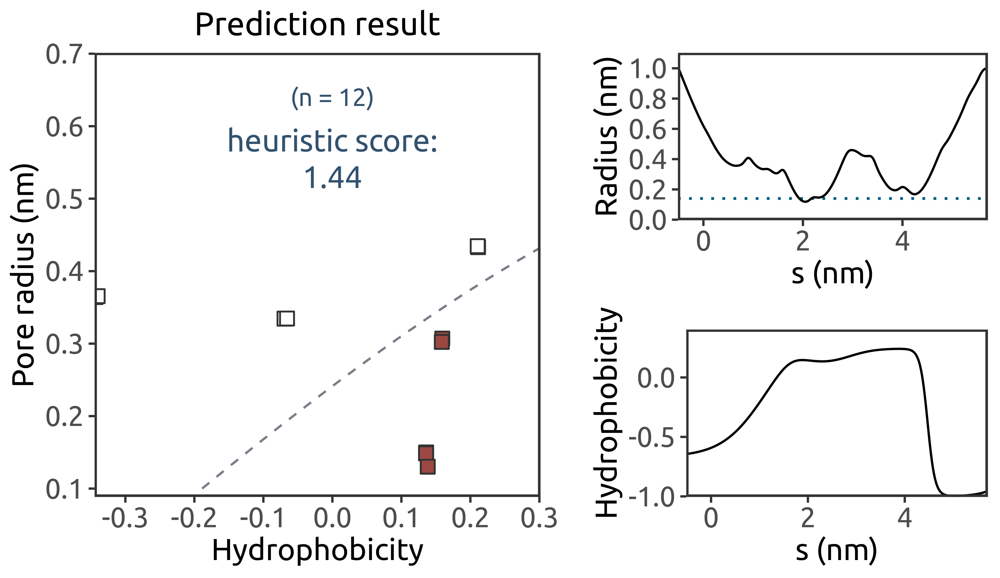

Combined with a predictive model which we have built based on a large amount of simulation data, the CHAP output for a given channel structure can be used to assess whether its conformation is likely to contain energetic barrier(s) to water, prior to any molecular dynamics simulation.

We will illustrate such a 'heuristic' method using a recent cryo-EM structure. As with the two previous tutorials, the example data can be downloaded from the `examples` directory.


## Running CHAP on the Structure

Under `examples/example-03/` you can find a structure file, `6mhs.pdb`, of the human TRPV3 channel (PDB: 6MHS). For a more accurate prediction, we have added any missing hydrogen atoms to the original PDB structure. 

To compute radius and hydrophobicity profiles for the channel structure, as well as identify any pore-lining amino acid side chains, type

```
chap -f 6mhs.pdb -s 6mhs.pdb -sel-pathway 1 -pm-pl-margin 0.55 -hydrophob-bandwidth 0.45 
```

where the PDB file is used as both input structure (`-f`) and input topology (`-s`), and the entire protein (group `1`) will be considered by the probe as it searches for the permeation pathway. For inclusion of pore-lining residues (`-pm-pl-margin`), we have found a distance cut-off value of `0.55` to be appropriate for most structures, although this may need to be increased or reduced for larger or smaller pores, respectively.

Once CHAP has been run, you can check via VMD or PyMOL whether a reasonable pathway is found through the channel, and whether all pore-lining and pore-facing residues are correctly identified.

To visualise the pathway in VMD, for example, copy the files from `chap/scripts/visualisation/VMD` to the working directory, and run VMD by typing:

```
vmd -e visualise_pathway.tcl
```

This will generate a representation of the protein as ribbons, with pore-lining residues represented by their van der Waals spheres, and a surface representation of the permeation pathway.

Once you are happy with the results (we include our own CHAP outputs for the example structure under `examples/example-03/`), they can be used as input for prediction of the pore hydration state by the heuristic method.


## Obtaining a Heuristic Score

The data file containing the predictive model and the plotting script that generates the heuristic score can be copied from `chap/scripts/heuristic/`.

With the three required files now present in the working directory (namely, the CHAP output `output.json`, the predictive model `heuristic_grid.json`, and the plotting script `heuristic_prediction.R`), the heuristic score can be calculated by running [R](https://www.r-project.org/):

```
./heuristic_prediction.R
```

This will map all the pore-facing residues in the channel structure, as identified by CHAP, to a landscape of local pore hydrophobicity and radius values, and generate the following plot:



The radius and hydrophobicity profiles through the channel permeation pathway are shown on the right in the image. For each pore-facing residue, the channel pore radius at its position is plotted against the corresponding local hydrophobicity value. The map is divided into two regions by a dashed contour line, corresponding to the likelihood of pore wetting (above the line) vs de-wetting (below it, with the likely presence of energetic barrier(s) to water) as predicted by our model. The chosen contour line represents a free energy of approximately 1 RT.

The sum of shortest distances between the dashed contour line and all points falling below it (coloured red) can then be used as a score for identifying closed gates. A structure is predicted to contain one or more energetic barriers to water permeation (and thus in a non-conductive state) if it has a heuristic score of greater than `0.55`.
