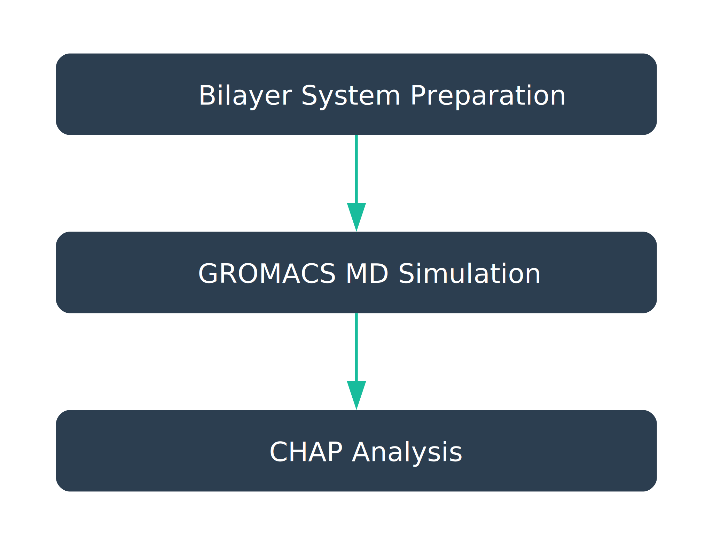

[memprotmd]: http://memprotmd.bioch.ox.ac.uk/home/
[membrane-builder]: http://www.charmm-gui.org/?doc=input/membrane.bilayer
[gromacs-tutorials]: http://www.mdtutorials.com/gmx/
[gromacs-documentation]: http://manual.gromacs.org/documentation/

Analysing the pore hydration behaviour of an ion channel is a three step procedure. First, the channel protein needs to be embedded in a lipid bilayer. This protein-bilayer system can then be simulated using the MD engine GROMACS. Finally, CHAP can be run on the resulting trajectory to calculate water density and free energy profiles.

The easiest way to obtain a protein-bilayer system is to download it from the [MemProtMD database][memprotmd]. You can search for a channel structure by e.g. PDB ID and then download a complete simulation system including GROMACS input files from the "Data Download" section at the bottom of the page. If your channel structure is not yet available on MemProtMD, you will need to embed it in a bilayer yourself. This can be done using the [CHARMM-GUI membrane builder][membrane-builder].

Once you have obtained a protein-bilayer system, performing the MD simulation is straightforward. In the files downloaded from [MemProtMD][memprotmd], you can find a detailed guide in the file `readme-at.txt`. In case you have never used GROMACS before, take a look at the [GROMACS tutorials][gromacs-tutorials] as well as the [GROMACS documentation][gromacs-documentation].

Having obtained a MD trajectory, you can proceed to run CHAP as described [here](http://www.channotation.org/docs/annotation_example/).
