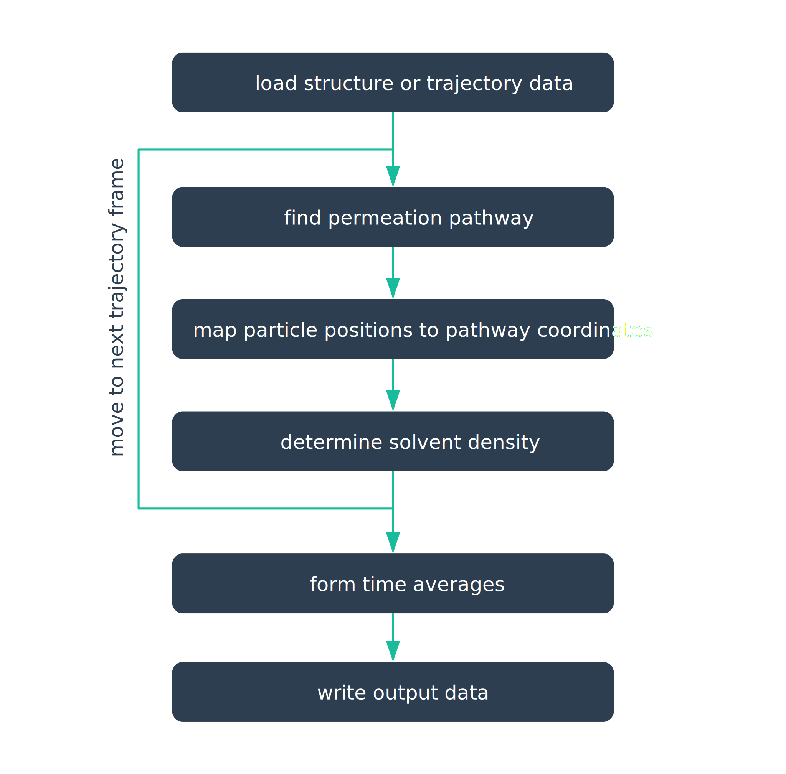

CHAP finds pores in biological macromolecules like ion channels and determines the hydration state of these permeation pathways. It can operate on both individual structures and on molecular dynamics trajectories and generally functions in the following way:

Each of the above steps and in particluar the pathway finding, position mapping, and solvent density estimation are controlled by a variety of parameters. A comprehensive list of these parameters and how they influence the behaviour of CHAP can be found in the following section. Note that (almost) all parameters come with sensible default values, but these have been determined specifically for the situation in ion channels and may need to be adapted if CHAP is applied to other systems. 

