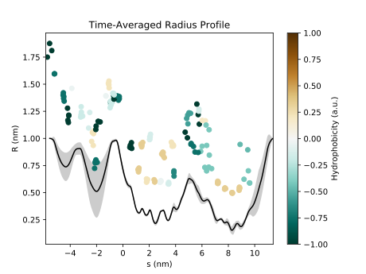

[JSON-spec]: https://www.json.org/
[Python]: https://www.python.org/
[matplotlib]: https://matplotlib.org/
[pip]: https://pypi.python.org/pypi/pip
[add-path]: https://unix.stackexchange.com/questions/26047/how-to-correctly-add-a-path-to-path


This page will walk you through loading CHAP output data into Python and show you how to visualise the radius profile of the permeation pathway. It also introduces a set of turnkey scripts bundled with CHAP that you can use to quickly visualise CHAP data. These scripts can serve as a good starting point for getting an overview of the data CHAP generates and can be adapted to suit your needs. It is assumed that you have some basic understanding of [Python][Python] and in particular of the [matplotlib][matplotlib] plotting system.


## Example: Plotting Time-averaged Pathway Profiles

As CHAP writes all relevant data into a single [JSON][JSON-spec] file, you need to load a JSON parser. Fortunately, as of version 2.6, Python already comes with a JSON library, which can be loaded via `import json`. CHAP data can then be loaded simply via:

```python
with open("output.json") as data_file:
    data = json.load(data_file)
```

This will parse the JSON data into a nested structure of Python dictionaries and arrays and you can use `data.keys()` to see how the data is structured at the highest level.

In order to plot the pathway radius profile, load the `matplotlib` and `numpy` libraries (these can be installed through `pip install matplotlib` and `pip install numpy`), then type the following:

```python
# load plotting and numerics libraries:
import numpy as np
from matplotlib import pyplot as pl

# begin new plot:
pl.figure("radius_profile")

# represent radius profile as black line:
pl.plot(                                                                        
    np.array(data["pathwayProfile"]["s"]),                                      
    np.array(data["pathwayProfile"]["radiusMean"]),                             
    "k-")  

# save plot to file:
pl.savefig("radius_profile.png")

# end figure definition:
pl.close("radius_profile")
```

The file `radius_profile.png` now contains a figure showing how the pore radius varies along the length of the permeation pathway. In order to add confidence intervals to this, we can extend the above code with

```python
pl.fill_between(                                                                
    np.array(data["pathwayProfile"]["s"]),                                      
    np.array(data["pathwayProfile"]["radiusMean"]) - radius_sd,                 
    np.array(data["pathwayProfile"]["radiusMean"]) + radius_sd,                 
    facecolor = "#000000",                                                      
    alpha = 0.2)
```

which will add a grey shaded area corresponding to the one sigma confidence interval around the mean radius line.

In addition to the radius profile, it is also interesting to look at the residues lining the permeation pathway. The below code will add a scatter plot of the pore-facing residues coloured by their respective hydrophobicity:

```python
pf = np.array(data["residueSummary"]["poreFacing"]["mean"]) > 0.5 
pl.scatter(                                                                     
    np.array(data["residueSummary"]["s"]["mean"])[pf],                          
    np.array(data["residueSummary"]["rho"]["mean"])[pf],                        
    c = np.array(data["residueSummary"]["hydrophobicity"])[pf],                 
    marker = "o",                                                               
    cmap = "BrBG_r")                                                            
pl.clim(                                                                        
    -max(abs(np.array(data["residueSummary"]["hydrophobicity"]))),              
    max(abs(np.array(data["residueSummary"]["hydrophobicity"]))))               
cbar = pl.colorbar()                                                            
cbar.ax.set_ylabel("Hydrophobicity (a.u.)")
```

Note that this only shows residues that are facing the permeation pathway more than 50% of the time.

All together, the above commands will generate a plot that should look like the following:



A similar procedure can be used to create plots of other pathway properties such as its hydrophobicity or the local solvent density. Take a look at `chap/scripts/plotting/Python/chap_plot_pathway_profile.py` for an overview of what other pathway properties can be plotted.


## Turnkey Plotting Scripts

To get a quick overview of the results of a CHAP run you can use the plotting scripts available under `chap/scripts/plotting/Python/`. There are three scripts, `chap_plot_pathway_profile.py`, `chap_plot_scalar_time_series.py`, and `chap_plot_profile_time_series.py`, each of which generates a set of figures that display time-averaged pathway profiles, scalar-valued time series, and vector-valued time series respectively.

The scripts require Python to be installed and the `python2` command to be available. They also need the `argparse`, `numpy`, and `matplotlib` libraries, which can be installed using `pip` (for example: `pip install numpy`). The easiest way to use the scripts is to copy them into your working directory, where you can run them by simply typing

```bash
./chap_plot_pathway_profile.py -filename output.json -dpi 300
./chap_plot_scalar_time_series.py -filename output.json -dpi 300 
./chap_plot_profile_time_series.py -filename output.json -dpi 300
```

This will read data from `output.json` and create PNG figures with a resolution of 300 dots per inch. Both arguments are optional and default to `output.json` and `300` respectively. To avoid copying the scripts to your working directoy each time you generate new data, you may consider [adding the script location to your PATH][add-path].
